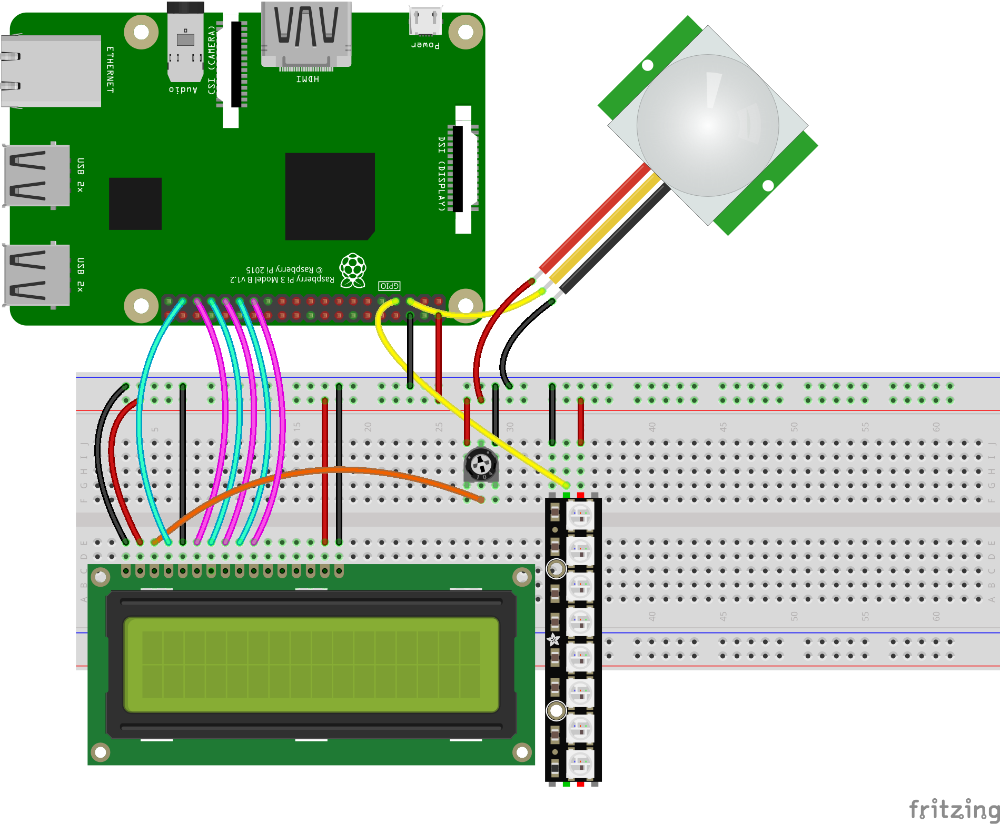

# CryptoPi.js

Cryptocurrency price-tracking app and hardware with Raspberry Pi 3 B+, first mocked with Arduino Uno Rev 3.

## Circuit schematic

## Brief description

App lets you keep track of prices of the most popular cryptos with hand gestures and soon with voice.

## Built With

* [Raspberry Pi 3B+](https://www.raspberrypi.org/)
* [Arduino](https://www.arduino.cc/)
* [Johnny Five](http://johnny-five.io/)
* [Node.js](https://nodejs.org/en/)
* Plenty of hardware from [Botland](https://botland.com.pl/)

## Further development

* Adding Google Assistant voice integration

## Acknowledgments

* Shoutout to [Daniel Shiffman](https://github.com/shiffman) and [noopkat](http://noopkat.com/) for showing me basics of Firmata protocol and j5
* Shoutout to [Forbot](https://forbot.pl/blog/) which is the best source of free electronics knowledge (Polish only)
