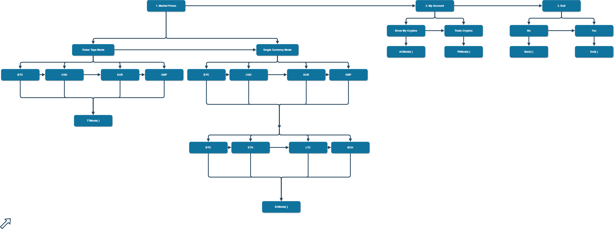
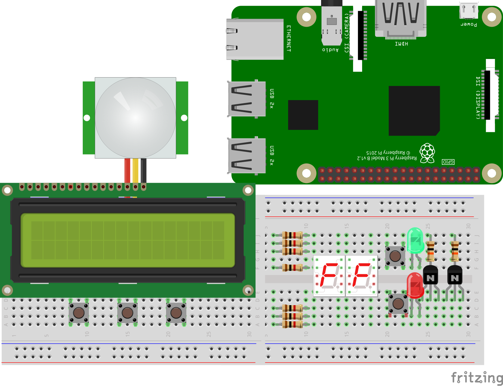

# CryptoPi.js

## Brief description

App lets you keep track of prices of the most popular cryptos with hand gestures and soon with voice.
It was mocked with Arduino, because of lack of Wi-Fi in Uno Rev 3 model, but now it's being developed on Raspberry Pi 3 B+.

## Main features

* Single Currency Mode - switching between currencies via hand gesture
* Ticker Tape Mode - crypto prices sliding like on old-school 90's Wall St. Ticker Tapes
* Trading/Account Mode - Check Your balance, buy/sell cryptos with a few button clicks
* Custom menu build as a Tree of Linked Lists

## Circuit schematic (without wiring, to keep it clean)

## How it works

Video compression hit this one hard. Sorry for the poor quality 😟

## Built With

* [Raspberry Pi 3B+](https://www.raspberrypi.org/) - credit card sized computer, 2018 model
* [Arduino Uno Rev 3](https://www.arduino.cc/) - affordable, yet powerful microcontroller
* [Johnny Five](http://johnny-five.io/) - JavaScript Robotics & IoT Platform
* [Node.js](https://nodejs.org/en/) - Needs no introduction
* Plenty of hardware from [Botland](https://botland.com.pl/)

## Further development

* Adding Google Assistant voice integration

## Acknowledgments

* Shoutout to [Daniel Shiffman](https://github.com/shiffman) and [noopkat](http://noopkat.com/) for showing me basics of Firmata protocol and j5
* Shoutout to [Forbot](https://forbot.pl/blog/) which is the best source of free electronics knowledge (Polish only)
